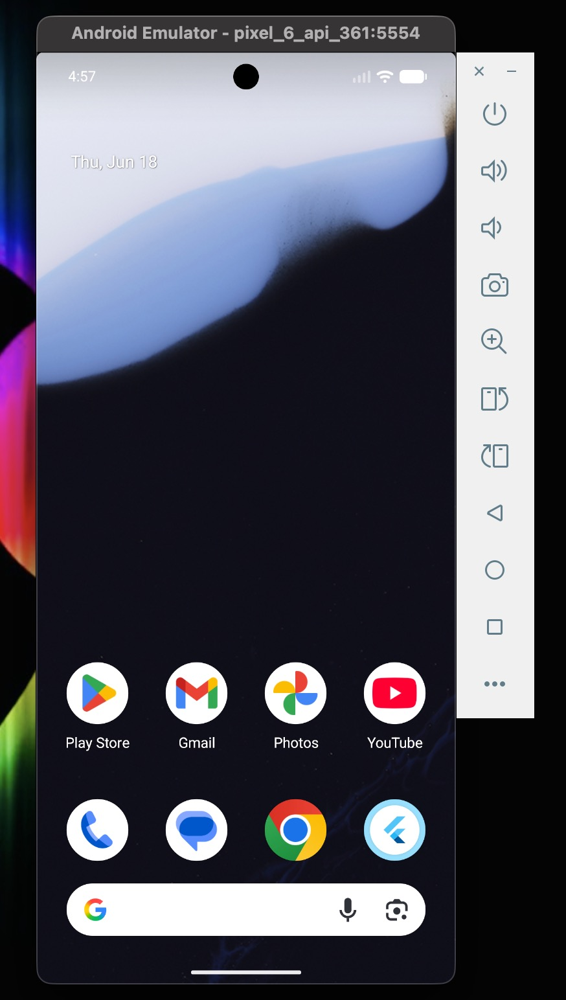
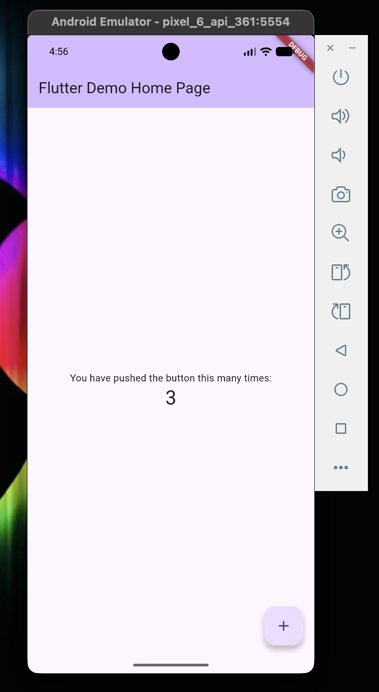
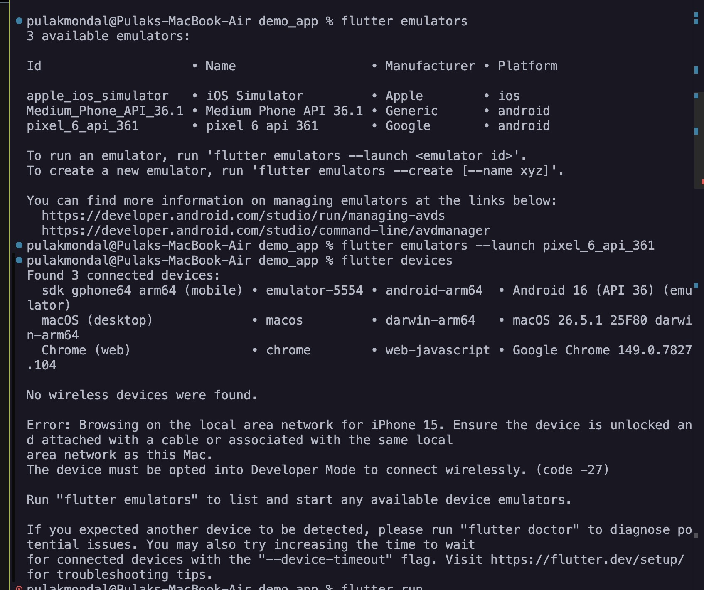
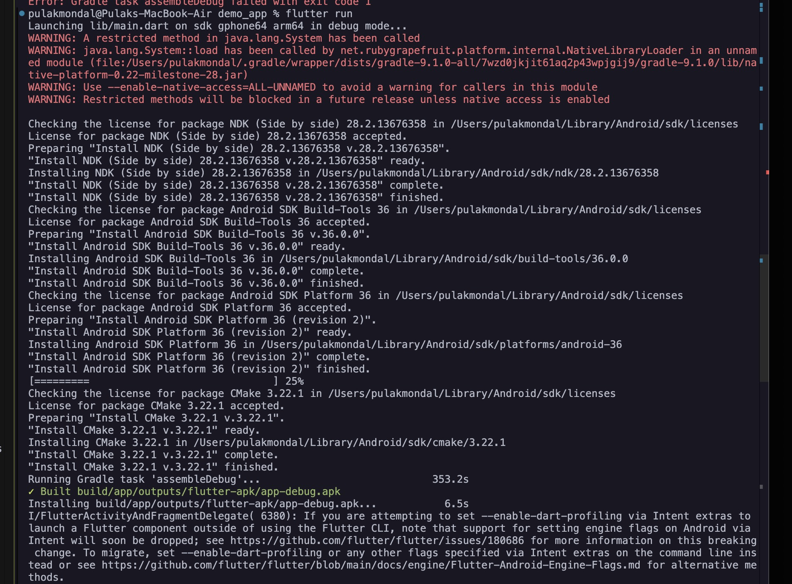
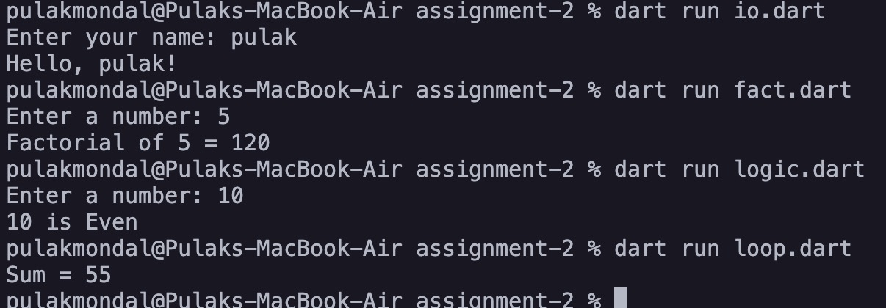
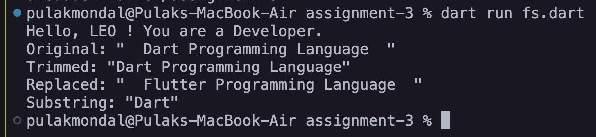
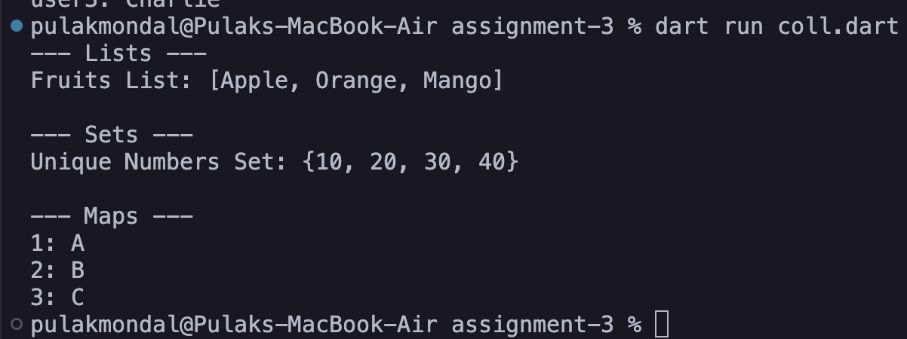
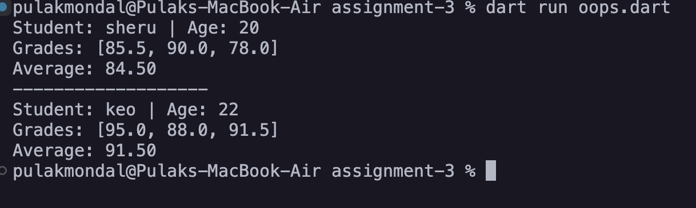

# Screenshots

<!-- # assignment-1

## Emulator Screen

## Application

## Terminal Output

 -->

# assignment-2

# output of example programs

# assignment-3
# output fs.dart

# output coll.dart

# output oops.dart

