# Visuals

# assignment-1

<!-- ## Emulator Screen

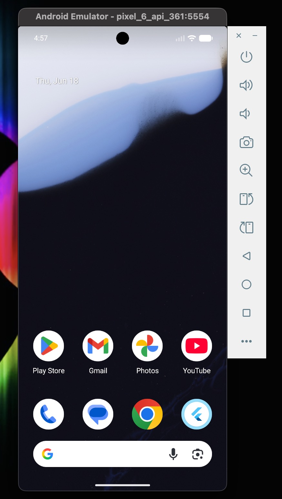

## Application

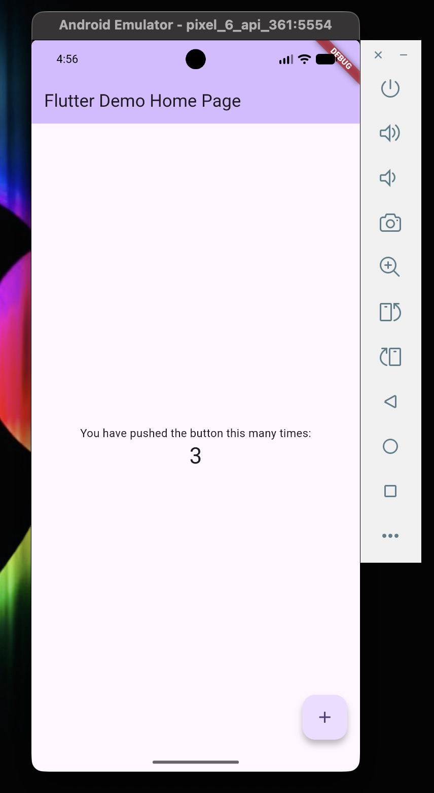

## Terminal Output

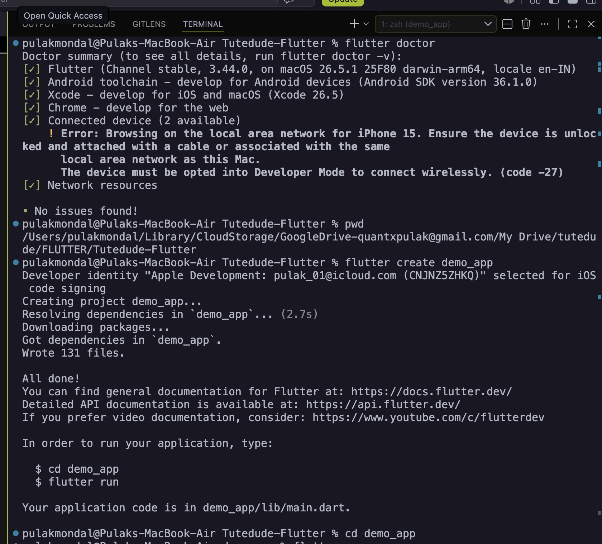

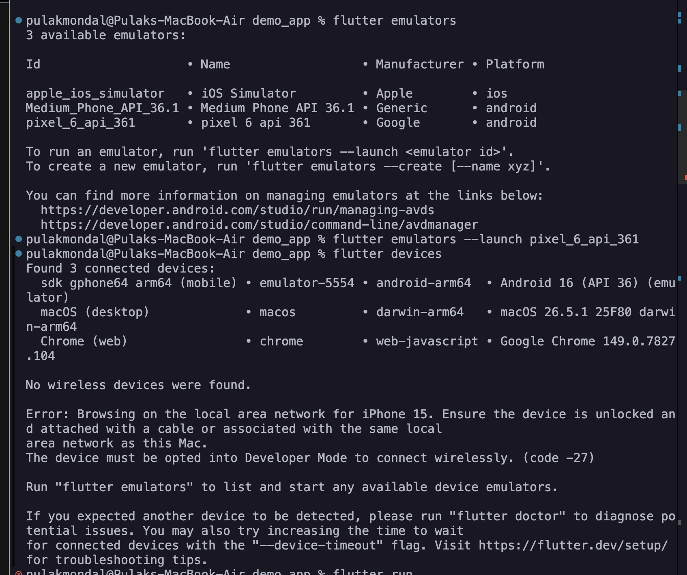

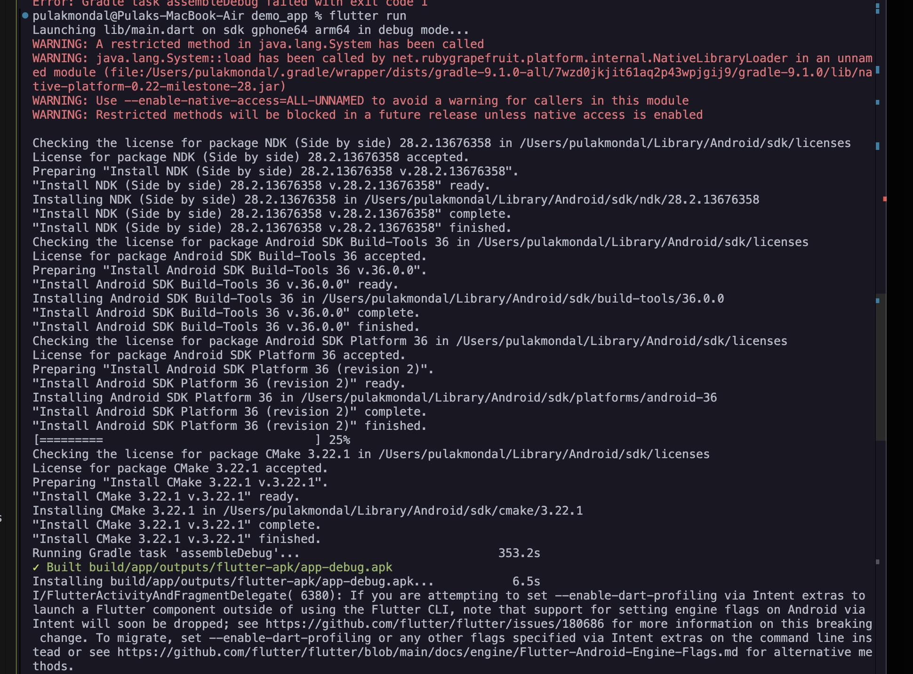

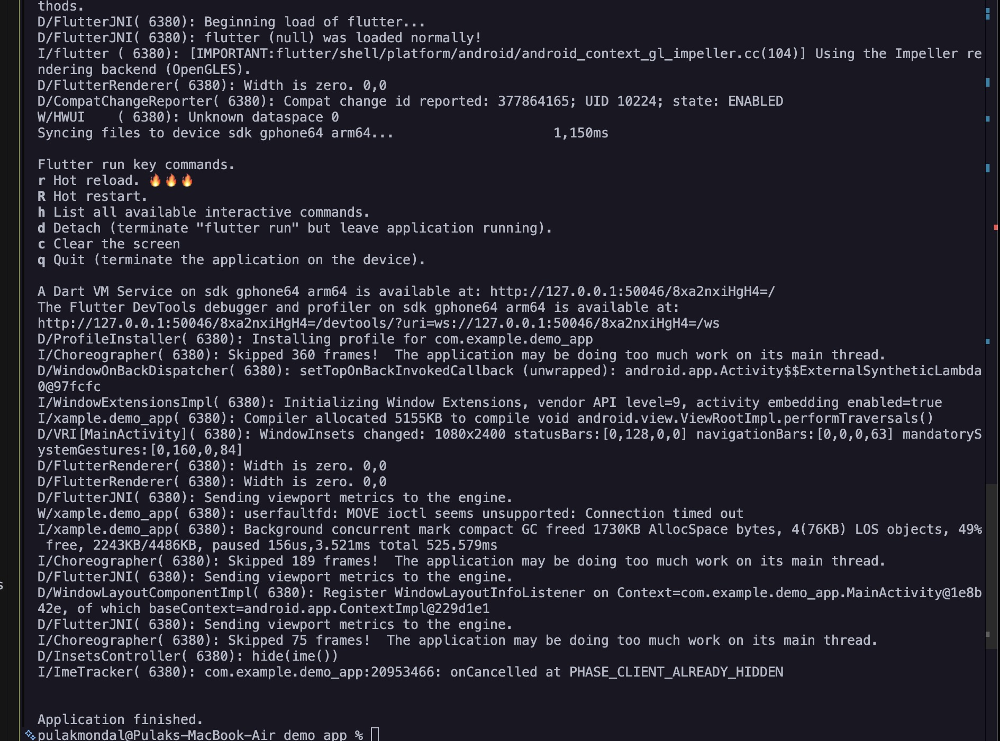 -->

# assignment-2

<!--     # output of example programs
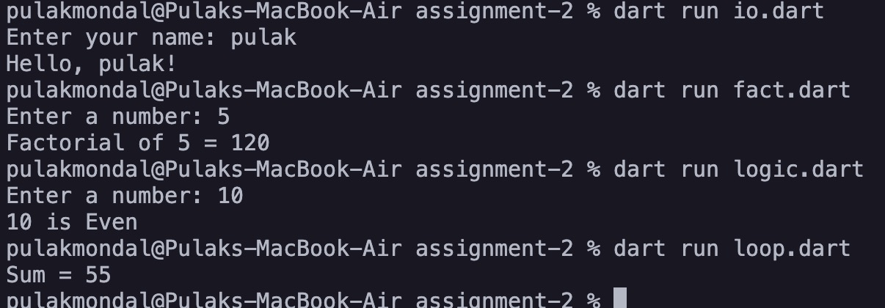 -->

# assignment-3

<!-- ## output fs.dart
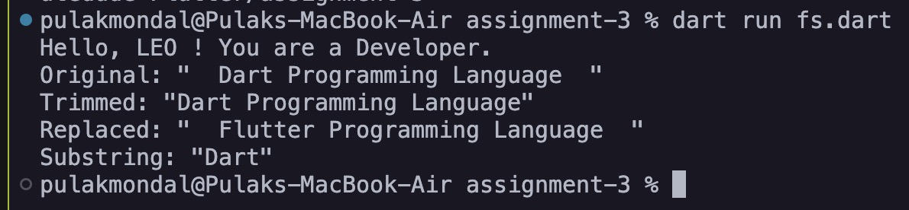
## output coll.dart
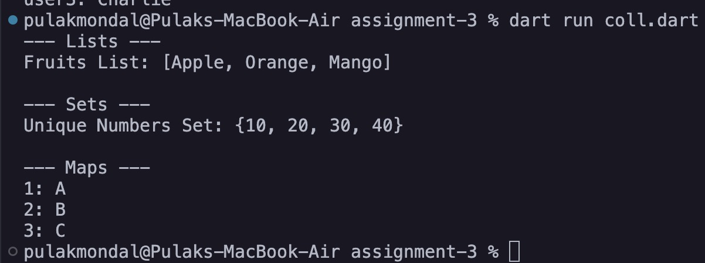
## output oops.dart
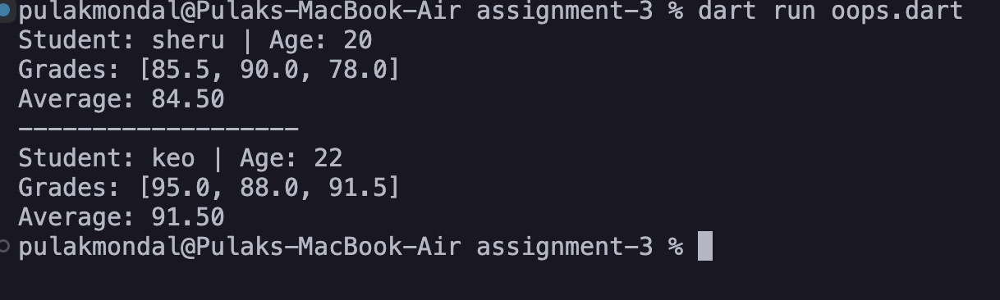 -->

# assignment-4

<!-- ## project creation
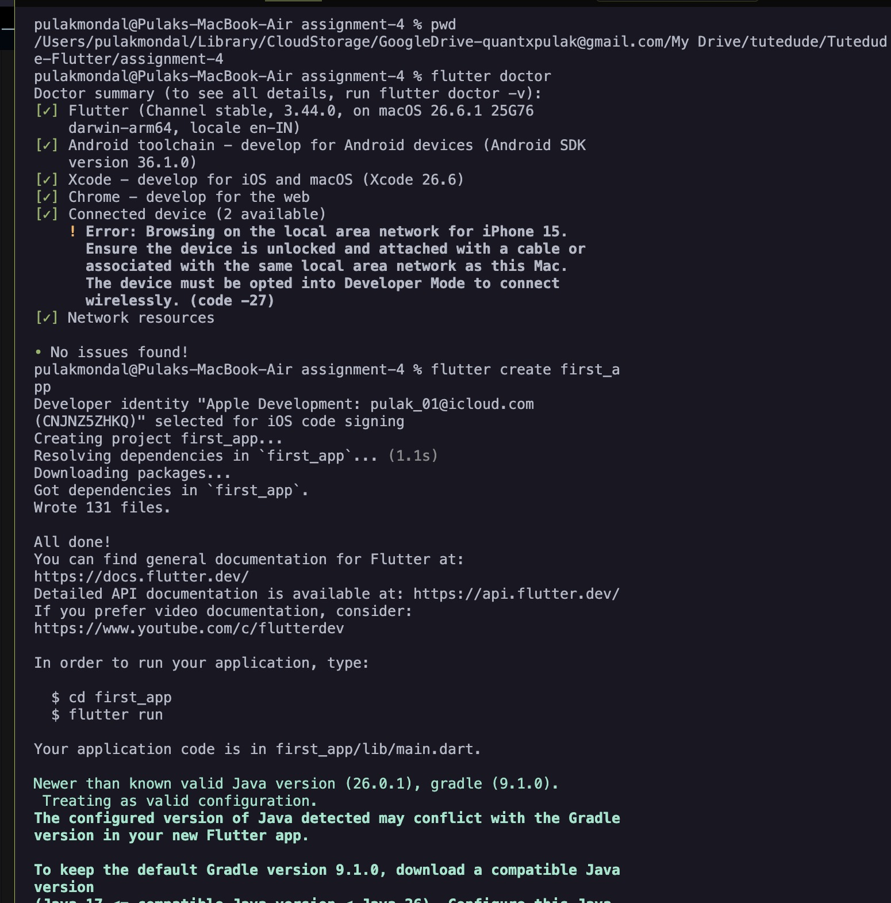

## emulator screen
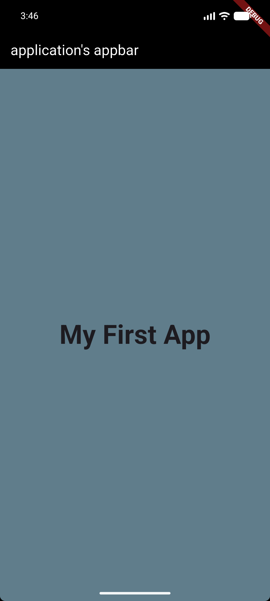 -->

# assignment-5

<!-- ve prepared the random quote generator screen ,,, including scaffold , appbar , container , row , column ,icon, padding , basic colours and fontstyle

## emulator screen

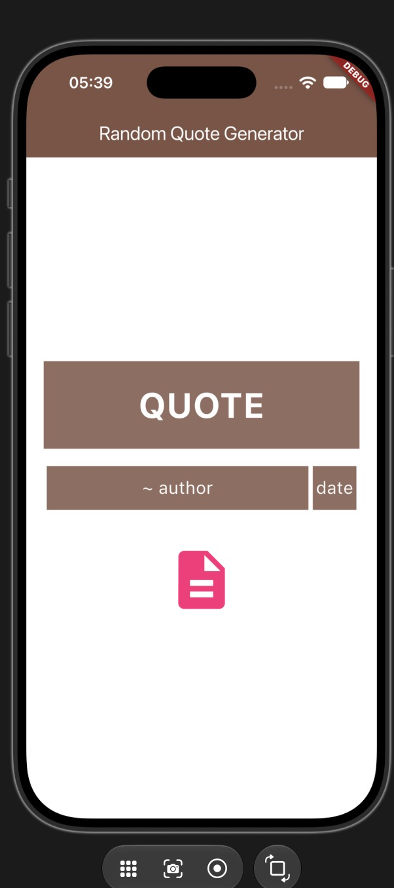
 -->
# assignment-7

<!-- ## Dice App
please go to the 'Visuals' ...i ve uploaded a video of it...no previewing option in readme.md 🥹

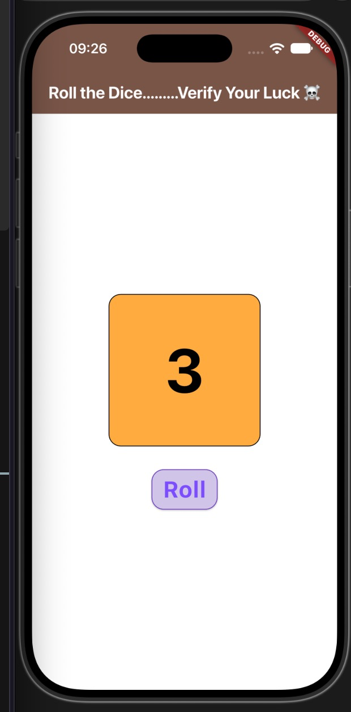

 -->

# assignment-8
## Journal App